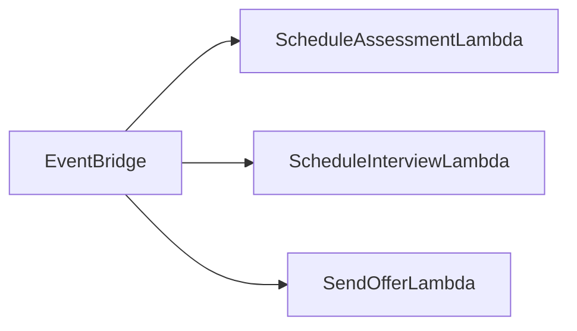
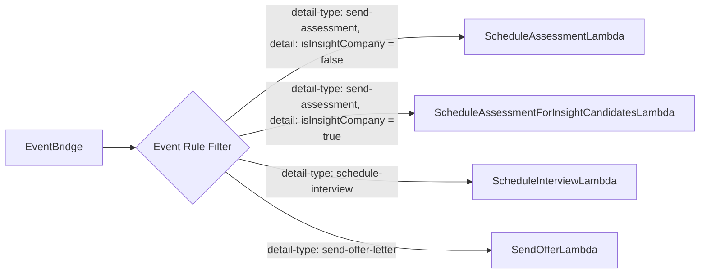

# event-driven-architecture-workshop

## Objectives
- Learn about event-driven architecture: https://serverlessland.com/event-driven-architecture/intro
- Practice working with AWS cli
- Setup AWS resources
- work with EventBridge events and buses https://us-east-1.console.aws.amazon.com/events/home?region=us-east-1#/eventbus
- work with SES 
- work with Lambda https://us-east-1.console.aws.amazon.com/lambda/home?region=us-east-1#/functions
- create a Pub/Sub pattern
- work with CDK
- work with CloudFormation
- trace events

## Exercise: 

You will create a Mini Applicant Tracking System (ATS) using an event-driven architecture in AWS. You will need to handle the following steps in a hiring pipeline: 

1. Send Assessment 
2. Schedule interview 
3. Send offer letter 

Workflow diagram:



## Steps:

### 0. IAM Permissions:
#### Lambda Functions
- use an existing IAM role or create a new one that has SES sendEmail permissions (AmazonSESFullAccess).
- we will use node 20.x runtime for these lambda functions


### 1. Send Assessment 
This will be a lambda function that uses CDK to call SES to send an invitation link to the candidate. 

[lambda code](/src/lambda/send-assessment.mjs)

lambda test payload:
``` json 
{
    "detail": {       
        "toEmail": "email@example.com",
        "fromEmail":"email@example.com",
        "companyName": "Example Corp"
    }
}
```

### 2. Schedule Interview with idempotency 
This will be a lambda function that uses CDK to call SES to send a generic calendar invite. 

[lambda code](/src/lambda/schedule-interview.mjs)


### 3. Send Offer Letter 
This will be a lambda function that sends the candidate an offer letter.

[lambda code](/src/lambda/send-offer-letter.mjs)

### 4. Create Event Bridge Bus to route events to all the lambdas 
Create your own named bus so your events do not mix with other people’s events. 
You will publish events on Event Bridge to emulate an API request. 

### 5. Create Event Rule to route events to the appropriate lambda function on your bus.
- name your rule after the event type and use your event bus
- event pattern:
```json
{
  "detail-type": ["send-assessment"]
}
```
- target: your lambda function


#### Tip: 
- Review CloudWatch logs and enable X-Ray to trace events. 

### 6. Test your event-driven architecture by publishing events to your event bus.
- send the following event to your event bus
```json
{
  "source": "manual-test",
  "detail-type": "send-assessment",
  "detail": {
    "toEmail": "email@example.com",
    "fromEmail":"email@example.com"
  }
}
```
- check the lambda logs to see if the event was processed.

### 7.  Repeat step 5 and 6 for the other events.
- remember to change the "detail-type" in the event pattern and the target to the appropriate lambda function.

```json
{
  "source": "manual-test",
  "detail-type": "schedule-interview",
  "detail": {
    "toEmail": "email@example.com",
    "fromEmail":"email@example.com"
  }
}
```

```json
{
  "source": "manual-test",
  "detail-type": "send-offer-letter",
  "detail": {
    "toEmail": "email@example.com",
    "fromEmail":"email@example.com"
  }
}
```


### 8. Duplicate your AWS resources into a CloudFormation template to deploy the stack. 
Use a cloudformation template to deploy your application.

Suggestion: start with 1 resource and incrementally add more resources to your template.

- Sample template for lambda: https://docs.aws.amazon.com/AWSCloudFormation/latest/UserGuide/aws-resource-lambda-function.html

- starting template for CloudFormation: [start.yml](/cloudformation/start.yml)
- try to fill out the rest of the template on your own using AWS's docs and co-pilot, but if you get stuck, you can use the finished template for reference.
- finished template for CloudFormation: [finish.yml](/cloudformation/finish.yml)

#### cmd to validate cloudformation template
```bash
aws cloudformation validate-template \
--template-body file://./cloudformation/start.yml
```

#### cmd to create new stack
```bash
aws cloudformation create-stack \
--template-body file://./cloudformation/start.yml \
--capabilities CAPABILITY_IAM \
--stack-name my-mini-ats-stack-workshop
```

#### cmd to create change set
- this creates a change set 
``` bash
aws cloudformation create-change-set \
--template-body file://./cloudformation/start.yml \
--change-set-name my-mini-ats-stack-workshop-changeset \
--capabilities CAPABILITY_IAM \
--change-set-type UPDATE \
--stack-name my-mini-ats-stack-workshop
```

#### cmd to execute change set
```bash
aws cloudformation execute-change-set \
--change-set-name my-mini-ats-stack-workshop-changeset \
--stack-name my-mini-ats-stack-workshop
```

#### clean up/delete stack
- delete the cloudformation stack and resources associated to it
- go to AWS console: https://us-east-1.console.aws.amazon.com/cloudformation/home


### Bonus:  
Create a custom flow for Insight Partners by updating the event bus to direct events to a new lambda function for insights based on event filtering. 

Insight does not want candidates to receive emails. Instead, Insights wants to receive a list of names and event ids to hand out to candidates during their on-site testing event.



### Bonus #2: 
Create a UI to trigger the different events in the ATS stages. 

## Additional Resources: 

Event Driven Architecture Overview: https://serverlessland.com/event-driven-architecture/intro 

 
## Additional workshops: 

ServerlEsspresso https://workshop.serverlesscoffee.com/ 

AWS workshop https://catalog.us-east-1.prod.workshops.aws/workshops/63320e83-6abc-493d-83d8-f822584fb3cb/en-US  